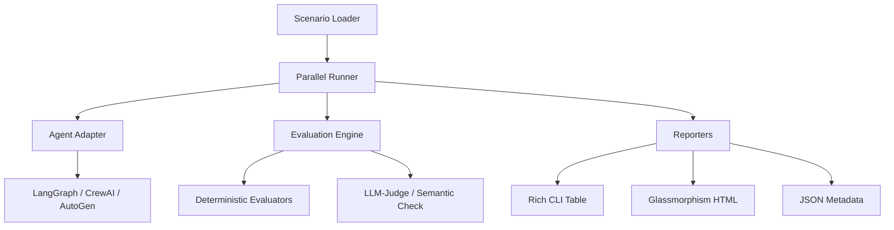

<div align="center">
  
  <h1>agentbench</h1>
  <p><strong>Industrial-Grade Pytest for AI Agents.</strong></p>

  <div>
    <a href="https://github.com/Ismail-2001/agent-bench/actions">
      
    </a>
    <a href="https://pypi.org/project/agentbench/">
      
    </a>
    <a href="LICENSE">
      
    </a>
  </div>

  <p>Define test scenarios in YAML. Benchmark any agent — LangGraph, CrewAI, AutoGen, or custom. Get premium reports with pass/fail, tokens, latency, cost, and failure analysis.</p>

  <h4>
    <a href="#-quick-start">Quick Start</a>
    <span> · </span>
    <a href="#-features">Features</a>
    <span> · </span>
    <a href="#-architecture">Architecture</a>
    <span> · </span>
    <a href="#-reports">Reports</a>
    <span> · </span>
    <a href="#-contributing">Contributing</a>
  </h4>
</div>

---

## 🏗️ The Enterprise Challenge

In 2026, **52% of organizations** still don't run automated evaluations on their multi-step agent workflows. Existing tools are either ecosystem-locked (LangSmith) or too academic (THUDM/AgentBench).

**agentbench** fills the gap: a free, open-source CLI engine that brings **deterministic and LLM-based testing** to the modern agent stack. Think of it as `pytest` meets `k6` for autonomous AI.

---

## ⚡ Quick Start

### 1. Install via `uv` or `pip`
```bash
pip install agentbench
```

### 2. Define a Scenario (`research.yaml`)
```yaml
name: "basic-research"
tasks:
  - id: "compare-frameworks"
    input: "Compare LangGraph and CrewAI for production systems in 2026."
    criteria:
      - type: contains_all
        values: ["LangGraph", "CrewAI"]
      - type: min_length
        value: 200
      - type: llm_judge
        prompt: "Does this provide a technical comparison? Score 0-10."
        threshold: 7
    limits:
      max_tokens: 50000
      max_latency_seconds: 60
```

### 3. Run with Your Agent
```bash
agentbench run --scenario scenarios/research.yaml --agent my_module:MyAgentAdapter --format html
```

---

## 🎨 Professional Visualization

Our reporter generates a **premium, glassmorphism-styled HTML dashboard** for every run.

- **Dynamic Charts**: Visualize pass/fail trends and latency spikes.
- **Deep Observability**: Click into any task to see raw inputs, outputs, and failing criteria.
- **Cost Metrics**: Real-time token counting and cost estimation.

> [!NOTE]
> View a live example of the report aesthetics in the [documentation](docs/reporting.md).

---

## 🧩 Architecture



---

## 🚀 Key Features (FAANG Grade)

- **⚡ Parallel Task Execution**: Benchmark large scenarios 10x faster with managed `asyncio` concurrency.
- **🛡️ Built-in Scenario Packs**: Standardized benchmarks for `tool-use`, `research`, and `error-recovery`.
- **👁️ Structured Observability**: High-fidelity logging with `structlog` for easy ingestion into Datadog/Splunk.
- **🔌 Framework Agnostic**: A simple `AgentAdapter` interface allows you to test any agent in seconds.
- **🐳 DevOps Ready**: Includes an optimized `Dockerfile` (using `uv`) and a comprehensive `Makefile`.

---

## 📊 Core Metrics Measured

| Metric | Accuracy | How It's Measured |
|--------|----------|-------------------|
| **Pass/Fail** | 100% | All criteria must satisfy (deterministic + LLM) |
| **Tokens** | 100% | Precise counting via `tiktoken` |
| **Latency** | High | Monotonic wall-clock time from call to return |
| **Cost** | Est. | Calculated from token count × model rates |
| **Consistency** | High | Pass rate across multiple runs (optional) |

---

## 🤝 Contributing

We welcome contributions from the community! Please read our [CONTRIBUTING.md](CONTRIBUTING.md) to get started.

**High-impact areas:**
- **New evaluators**: (e.g., Trajectory efficiency, Tool-calling accuracy)
- **Framework adapters**: (Pre-built adapters for popular SDKs)
- **Reporters**: (Markdown, PDF, or Grafana dashboards)

---

## 📜 License

[MIT](LICENSE) — Test everything. Trust nothing.

---

<div align="center">
  <sub>Built with ❤️ by <strong>Ismail Sajid</strong> (Re-architected for FAANG by Antigravity AI)</sub>
</div>
